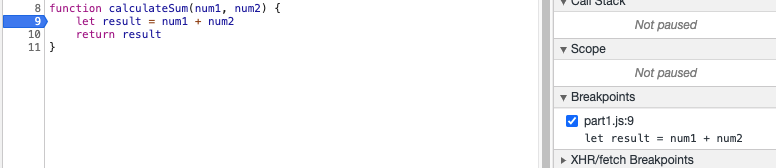
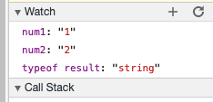
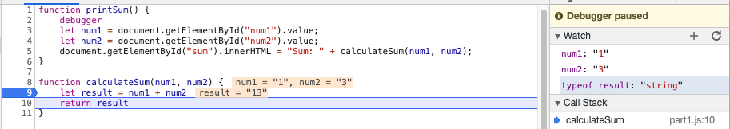
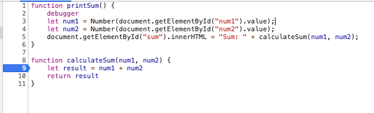

# Part 3

## DevTools - Debugging

I added a breakpoint as so:

and watch expressions as so:

After running the debugger and stepping to the next line after the breakpoint, I saw that the watch expressions were showing that `num1` and `num2` were both strings and `typeof result` was also a string. So this shows that the bug is that when calculating sum, it was adding the two numbers as strings instead of numbers.

However, I went up the call stack and saw that `num1` and `num2` were read from `document.getElementById("num1").value` and `document.getElementById("num2").value` meaning those two were string values. Looking at the calculating sum code, it actually works as it does indeed add numbers but the data given was not correct.

Thus, I fixed it by converting explicitly the values retrieved from the document into numbers as so:

## DevTools - Network Tab

1. The name of the new json file is `citylots.json`

2. `part2.js` initiated the download

3. Assuming the question refers to the file size of the new json file, the file size is `11.7 MB`. 

4. It took me 5.46 seconds to download

5. Request Headers contained `User-Agent: Mozilla/5.0 (Macintosh; Intel Mac OS X 10_15_7) AppleWebKit/537.36 (KHTML, like Gecko) Chrome/88.0.4324.96 Safari/537.36`

6. It came from an Apache server

7. The file was last modified `Tue, 26 Jan 2021 22:14:13 GMT`

8. The content type was `application/json`

9. `fetchData` was the method that made the request